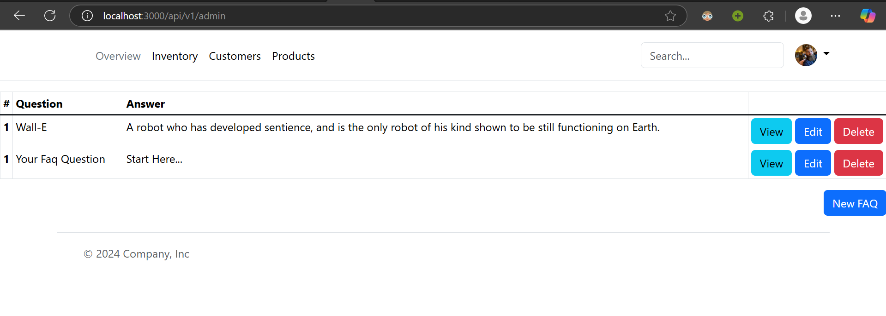
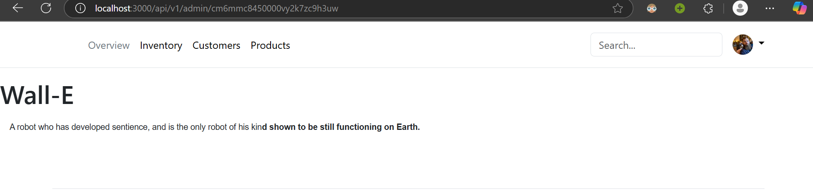
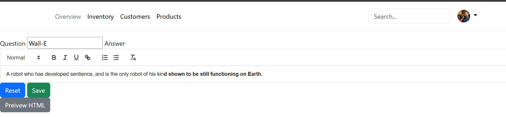
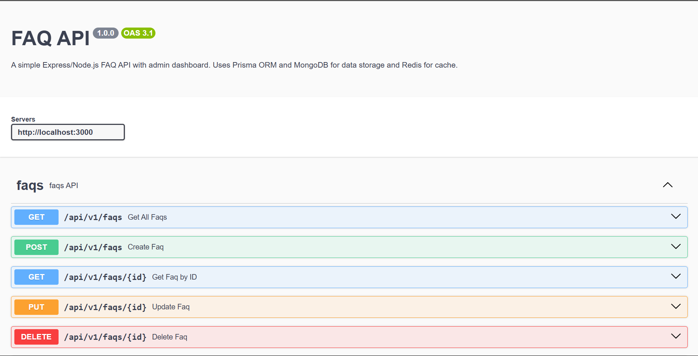

# BharatFD

Submission for backend assignment BharatFD.
Node.js/Express.js Api that can create, read, update and delete FAQ.

1. Uses `MongoDB` for Database using `Prisma ORM`.
2. Supports Caching using `Redis`.
3. Implemented WYSIWYG Editor using `Quill`
4. Rest API Implemented
5. Translatation using `google-translate-x` api
6. Admin Dashboard using `EJS`
7. Testing using `Vitest`
8. API documentation using `Swagger`
9. `Docker` support

## Installation

1. Clone the repository:

```bash
git clone https://github.com/JaiSwarup/express-api.git
```

2. Navigate to the project directory:

```bash
cd express-api
```

3. Setup environment variables

```bash
cp .env.example .env
```

4. Install the dependencies:

```bash
npm install
```

## Develop

```bash
npm run dev
```

Visit `http://localhost:3000/api-docs`

## API Usage

### GET `/api/v1/faqs`

    Get All Faqs
    Parameters
    q = string(query)
        Search term for FAQs

`Responses`\
🟢 200 OK

🔴 500 Server Error

### POST `/api/v1/faqs`

    Create Faq

    Parameters

`Request Body Schema`

```
    {
        "question": "string",
        "answer": "string",
        "text": "string"
    }
```

`Responses`\
🟢 201 Created

❌ 400
Bad Request

🔴 500
Server Error

### GET `/api/v1/faqs/{id}`

    Get Faq by ID

    Parameters
    id string (path)
    Faq ID

    lang string (query)
    Language

`Responses`\
🟢 200 OK

❌ 404 Not Found

🔴 500 Server Error

### PUT `/api/v1/faqs/{id}`

    Update Faq

    Parameters

    id string
    (path)
    Faq ID

    id
    Request body

`Request Body Schema`

```
    {
        "question": "string",
        "answer": "string",
        "lang": "string"
    }
```

`Responses`\
🟢 200 OK

❌ 400 Bad Request

❌ 404 Not Found

🔴 500 Server Error

### DELETE `/api/v1/faqs/{id}`

    Delete Faq

    Parameters
    id string (path)
    Faq ID

`Responses`\
🟢 204
No Content

❌ 404
Not Found

🔴 500
Server Error

### POST `/api/v1/faqs/{id}/translate`

    Update Faq

    Parameters

    id string (path)
    Faq ID

    lang string (query)
    Language

`Responses`\
🟢 200 OK

❌ 400 Bad Request

❌ 404 Not Found

🔴 500 Server Error

## Admin Dashboard

### Display all FAQs

`api/v1/admin`



### View Faq

`api/v1/admin/{id}`



### Edit Faq

`api/v1/admin/{id}/edit`



## API Docs

`api-docs`


## Contribution Guidelines

1. Fork the repository.
2. Create a new branch:
   ```bash
   git checkout -b feature-branch
   ```
3. Make your changes and commit them:
   ```bash
   git commit -m "Description of changes"
   ```
4. Push to the branch:
   ```bash
   git push origin feature-branch
   ```
5. Open a pull request.

Please ensure your code adheres to the project's coding standards and includes appropriate tests.
